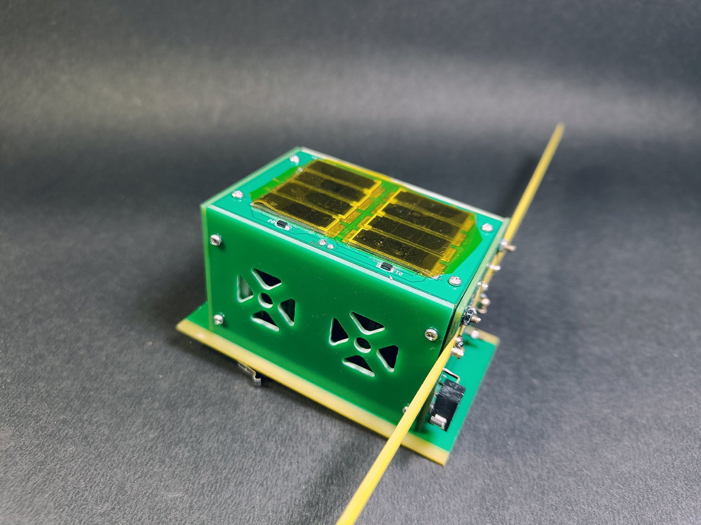

# PikoQube: PocketQube Training Kit
A pocketqube is a satellite which has a dimension of 5x5x5 cm and weighs less than 250 grams. PikoQube is based on the design of Sanosat-1 designed by ORION Space which was launched on Jan 2022 via SpaceX.

## PikoQube PocketQube Kit
It is a 5x5x75mm satellite on the form factor of a 1.5P PocketQube. One of the side is covered by solar panel. It consists of 4 PCBs EPS, OBC, COM and Payload inside and Solar Panels, Base Plate and other panels the make up the structure of the PocketQube.

## Subsystems
- EPS: Its function is the boost the voltage from the solar panel to charge a single cell Li-ion battery. It also monitors the current and voltage that charges the battery.
- OBC: It is powered by ATMEGA328 Microcontroller and also consists of built in programmer. A usb cable can be used to program it via arduino platform.
- Communication: It consists of Si446x based communication module that supports CW, FSK and GFSK Modulation.
- Payload: The payload consists of basic sensors like accelerometer, gyroscope, temperature sensor and pressure sensor.
- Software Defined Radio

